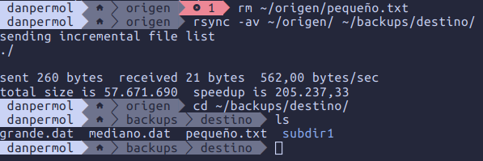
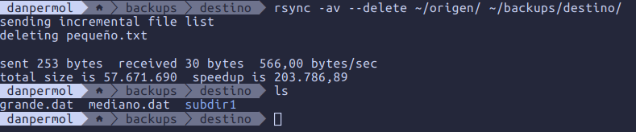
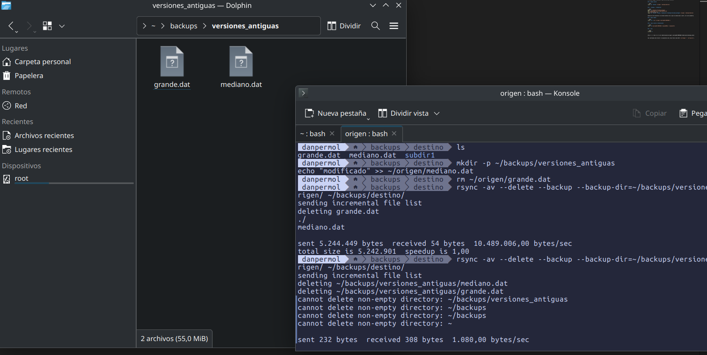
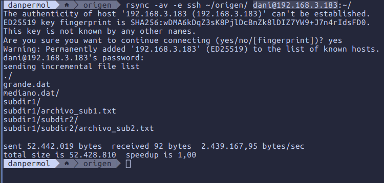
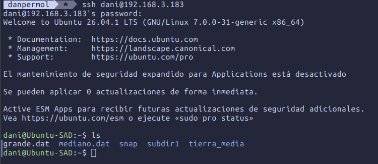
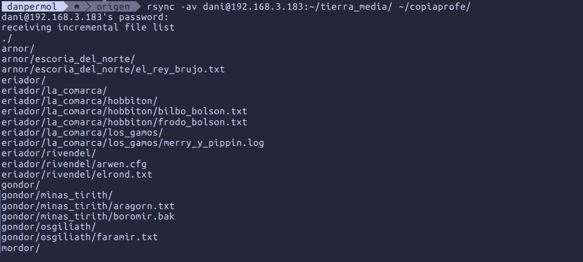
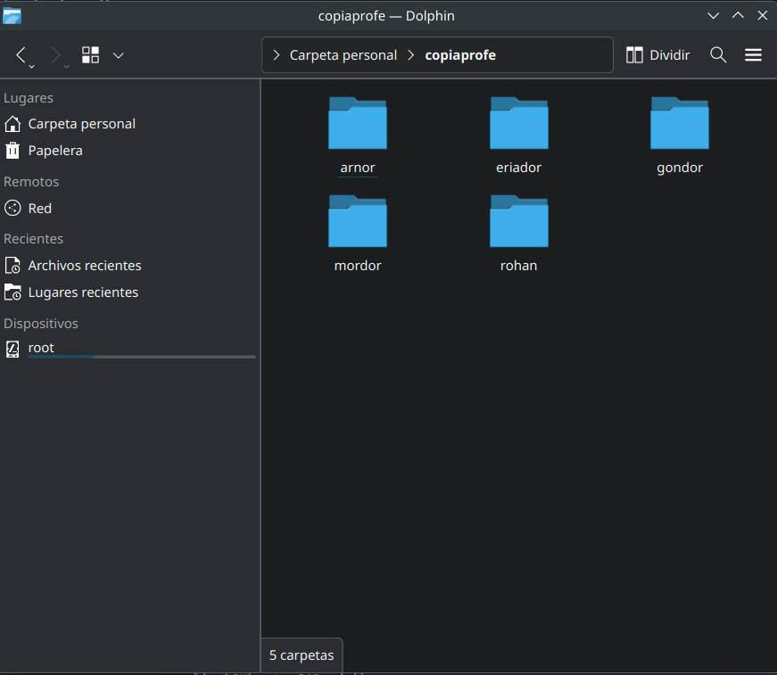
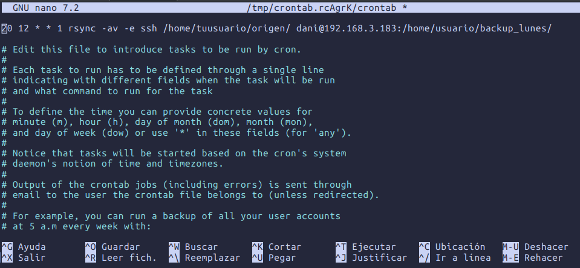

# Tarea 3: rsync 

## Preparación

```bash
mkdir -p ~/origen/subdir1/subdir2
echo "texto" > ~/origen/pequeño.txt
dd if=/dev/urandom of=~/origen/mediano.dat bs=1M count=5
dd if=/dev/urandom of=~/origen/grande.dat bs=1M count=50
echo "sub1" > ~/origen/subdir1/archivo_sub1.txt
echo "sub2" > ~/origen/subdir1/subdir2/archivo_sub2.txt
mkdir -p ~/backups/destino
```


## 1. -rv vs -av

```bash
rsync -rv ~/origen/ ~/backups/destino/
rsync -av ~/origen/ ~/backups/destino/
```

`-r` solo copia contenido recursivamente. `-a`  además conserva permisos, dueño, grupo, fecha y enlaces. Compara con `ls -l` en origen/destino.


## 2. Borrar archivo en origen y repetir copia

```bash
rm ~/origen/pequeno.txt
rsync -av ~/origen/ ~/backups/destino/
```



El archivo sigue en destino: rsync no borra por defecto.

## 3. Espejo exacto

```bash
rsync -av --delete ~/origen/ ~/backups/destino/
```


## 4. --backup / --backup-dir

```bash
mkdir -p ~/backups/versiones_antiguas
echo "modificado" >> ~/origen/mediano.dat
rm ~/origen/grande.dat
rsync -av --delete --backup --backup-dir=~/backups/versiones_antiguas ~/origen/ ~/backups/destino/
```

Guarda en otro directorio la versión anterior de lo que se sobrescribe o borra, en vez de perderla.



## 5. Copia remota

```bash
rsync -av -e ssh ~/origen/ dani@192.168.3.183:~/
```


## 6. rsync inverso (restauración)

```bash
rsync -av dani@192.168.3.183:~HOME~ ~/copiaprofe/
```



## 7. Cron

```bash
crontab -e
```

```
20 12 * * 1 rsync -av -e ssh /home/tuusuario/origen/ dani@192.168.3.183:/home/dani/backup_lunes/
```


Con contraseña esto fallará al ejecutarse solo; hace falta clave SSH (`ssh-keygen` + `ssh-copy-id`).